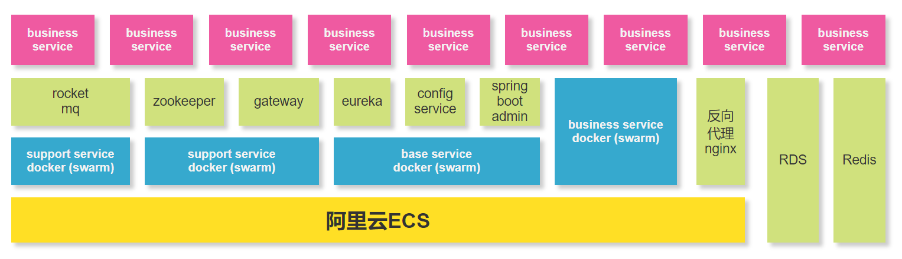
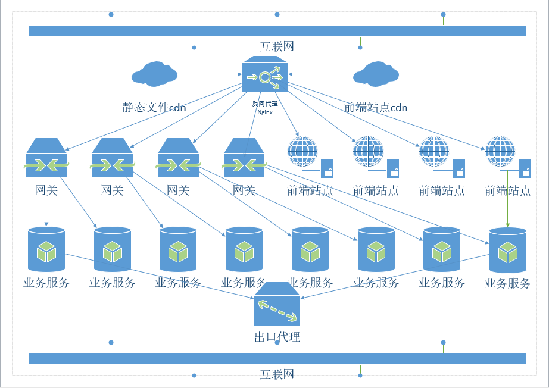

# 服务器架构说明

## 架构图

## 网络图

## 服务器情况

现有服务器28台

- 基础设施

| v3nginx      |                |
| ------------ | -------------- |
| 弹性公网IP： | 47.98.156.252  |
| 私有IP：     | 172.16.149.245 |
| nginx 服务   |                |

| proxy-local  |              |
| ------------ | ------------ |
| 弹性公网IP： | 47.96.14.81  |
| 私有IP：     | 172.16.84.99 |
| 代理         |              |

| v3-base-mq001 |                |
| ------------- | -------------- |
| 弹性公网IP：  | 114.55.171.242 |
| 私有IP：      | 172.16.149.249 |
| rocketmq      |                |

| v3-base-mq002 |                |
| ------------- | -------------- |
| 弹性公网IP：  | 47.110.226.218 |
| 私有IP：      | 172.16.84.204  |
| rocketmq      |                |

| v3eureka001                         |                |
| ----------------------------------- | -------------- |
| 弹性公网IP：                        | 47.110.137.241 |
| 私有IP：                            | 172.16.84.206  |
| eureka+配置+spring-boot-admin+timer |                |

| v3eureka002                         |                |
| ----------------------------------- | -------------- |
| 弹性公网IP：                        | 114.55.171.107 |
| 私有IP：                            | 172.16.149.248 |
| eureka+配置+spring-boot-admin+timer |                |

| v3-publish    |             |
| ------------- | ----------- |
| 弹性公网IP：  | 47.110.9.96 |
| 私有IP：      | 172.16.21.6 |
| 远程连接：    | root        |
| 发布服务+日志 |             |

| v3-gateway001 |               |
| ------------- | ------------- |
| 弹性公网IP：  | 47.111.11.230 |
| 私有IP：      | 172.16.84.205 |
| gateway zk    |               |

| v3-gateway002   |              |
| --------------- | ------------ |
| 弹性公网IP：    | 47.110.14.10 |
| 私有IP：        | 172.16.21.4  |
| gateway zk 前端 |              |

| v3-gateway003            |              |
| ------------------------ | ------------ |
| 弹性公网IP：             | 47.110.12.94 |
| 私有IP：                 | 172.16.21.7  |
| erp网关 微信网关 zk 前端 |              |

| v3-gateway004            |                |
| ------------------------ | -------------- |
| 弹性公网IP：             | 114.55.169.175 |
| 私有IP：                 | 172.16.149.247 |
| erp网关 微信网关 zk 前端 |                |

- 业务服务

|              | v3-BS-F001    | v3-BS-F002    | v3-BS-F003     | v3-BS-F004     |
| ------------ | ------------- | ------------- | -------------- | -------------- |
| 弹性公网IP： | 47.98.220.95  | 47.111.105.30 | 47.111.105.137 | 47.111.105.218 |
| 私有IP：     | 172.16.225.64 | 172.16.225.65 | 172.16.225.66  | 172.16.225.67  |
| 业务服务     | F可用区       |               |                |                |

|              | v3-BS-H001     | v3-BS-H002     | v3-BS-H003     | v3-BS-H004     |
| ------------ | -------------- | -------------- | -------------- | -------------- |
| 弹性公网IP： | 47.111.169.175 | 114.55.171.6   | 47.111.186.205 | 114.55.209.3   |
| 私有IP：     | 172.16.149.251 | 172.16.149.252 | 172.16.149.253 | 172.16.149.254 |
| 业务服务     | H可用区        |                |                |                |

|              | v3-BS-G001    | v3-BS-G002    | v3-BS-G003    | v3-BS-G004    |
| ------------ | ------------- | ------------- | ------------- | ------------- |
| 弹性公网IP： | 114.55.243.46 | 47.98.158.5   | 47.98.220.48  | 47.111.79.177 |
| 私有IP：     | 172.16.84.207 | 172.16.84.208 | 172.16.84.209 | 172.16.84.210 |
| 业务服务     | G可用区       |               |               |               |

|              | v3-BS-I001    | v3-BS-I002     | v3-BS-I003    | v3-BS-I004    |
| ------------ | ------------- | -------------- | ------------- | ------------- |
| 弹性公网IP： | 114.55.243.77 | 114.55.242.246 | 47.110.15.201 | 114.55.243.68 |
| 私有IP：     | 172.16.21.8   | 172.16.21.9    | 172.16.21.10  | 172.16.21.11  |
| 业务服务     | I可用区       |                |               |               |

| v3-tag           |             |
| ---------------- | ----------- |
| 弹性公网IP：     | 47.110.13.5 |
| 私有IP：         | 172.16.21.5 |
| 统计打标 监控 im |             |

## 支撑服务说明

### 数据库服务

数据库是阿里云rds，配置如下：

CPU:2 核	数据库内存:4096MB	最大IOPS:2000	最大连接数:1200

可开通读写分离。

内网地址:rm-bp1qn4bl8d8p9mnm4.mysql.rds.aliyuncs.com	内网端口:3306
外网地址:rm-bp1qn4bl8d8p9mnm44o.mysql.rds.aliyuncs.com	外网端口:3369

### 缓存服务

缓存服务采用阿里云redis，配置如下：

规格：8G	最大内网带宽 192 MByte
版本： Redis 4.0	最大连接数 20000

host: r-bp15293fccccc784.redis.rds.aliyuncs.com
port: 6379
password: c1c468a4e9Sjfx

### 队列服务

队列为自建双主rocketmq，配置如下：

规格：8GX2

broker-m1	master	172.16.149.249:9876
broker-m2	master	172.16.84.204:9876

监控地址：

[http://114.55.171.242:9011](http://114.55.171.242:9011/)

[http://47.110.226.218:9011](http://47.110.226.218:9011/)

仅公司内网可访问

### Zookeeper

zookeeper提供dubbo等服务注册用，采用区自从部署，监控地址：

<http://v3zkstats.sjfx.com.cn/>

### 其它基础服务

其它服务包括网关、eureka、spring.boot.admin、出口代理服务、配置服务等，监控地址如下：

<https://eureka1.sjfx.com.cn/>

<https://eureka2.sjfx.com.cn/>

[http://springbootadmin1.sjfx.com.cn](http://springbootadmin1.sjfx.com.cn/)

[http://springbootadmin2.sjfx.com.cn](http://springbootadmin2.sjfx.com.cn/)

springbootadim 账号密码 sjfx:sjfx-2018

### 服务监控及管理

服务器监控查看：<http://v3netdata.sjfx.com.cn/netdata/index.html>

docker服务监控及管理：

1. 基础支撑：[https://portainerbase.sjfx.com.cn](https://portainerbase.sjfx.com.cn/) 包括：mq、docker、elk仓库等
2. 基础服务：[https://portainerbs.sjfx.com.cn](https://portainerbs.sjfx.com.cn/) 包括：eureka、spring.boot.admin、出口代理服务、配置服务、配置服务的git仓库等
3. 网关服务：[https://portainergw.sjfx.com.cn](https://portainergw.sjfx.com.cn/) 包括：网关（基础、微信、erp）、zookeeper、前端站点
4. 业务服务：[https://portainerbusiness.sjfx.com.cn](https://portainerbusiness.sjfx.com.cn/) 其它所有业务服务

所有portainer服务账号密码 sjfx:sjfx@2019

### 发布服务及docker仓库

发布地址：<https://jenkins.sjfx.com.cn/>

账号密码 sjfx:sjfx@2019

前端服务根据项目名称。

后端服务根据对应表：

| 服务              | 发布数量 | 发布地址                                           | 回滚地址                                            |
| ----------------- | -------- | -------------------------------------------------- | --------------------------------------------------- |
| account           | 4        | https://jenkins.sjfx.com.cn/job/build-f1-h1-g1-i1/ | https://jenkins.sjfx.com.cn/job/deploy-f1-h1-g1-i1/ |
| authorization     | 4        | https://jenkins.sjfx.com.cn/job/build-f1-h1-g1-i1/ | https://jenkins.sjfx.com.cn/job/deploy-f1-h1-g1-i1/ |
| user              | 4        | https://jenkins.sjfx.com.cn/job/build-f1-h1-g1-i1/ | https://jenkins.sjfx.com.cn/job/deploy-f1-h1-g1-i1/ |
| wxgateway         | 4        | https://jenkins.sjfx.com.cn/job/build-f1-h1-g1-i1/ | https://jenkins.sjfx.com.cn/job/deploy-f1-h1-g1-i1/ |
| activity          | 4        | https://jenkins.sjfx.com.cn/job/build-f1-h1-g1-i1/ | https://jenkins.sjfx.com.cn/job/deploy-f1-h1-g1-i1/ |
| tenant            | 2        | https://jenkins.sjfx.com.cn/job/build-f2-h2/       | https://jenkins.sjfx.com.cn/job/deploy-f2-h2/       |
| booking           | 2        | https://jenkins.sjfx.com.cn/job/build-f2-h2/       | https://jenkins.sjfx.com.cn/job/deploy-f2-h2/       |
| coupon            | 2        | https://jenkins.sjfx.com.cn/job/build-f2-h2/       | https://jenkins.sjfx.com.cn/job/deploy-f2-h2/       |
| employee          | 2        | https://jenkins.sjfx.com.cn/job/build-f2-h2/       | https://jenkins.sjfx.com.cn/job/deploy-f2-h2/       |
| deliver           | 2        | https://jenkins.sjfx.com.cn/job/build-f2-h2/       | https://jenkins.sjfx.com.cn/job/deploy-f2-h2/       |
| customer          | 2        | https://jenkins.sjfx.com.cn/job/build-f2-h2/       | https://jenkins.sjfx.com.cn/job/deploy-f2-h2/       |
| erp-sync          | 2        | https://jenkins.sjfx.com.cn/job/build-f2-h2/       | https://jenkins.sjfx.com.cn/job/deploy-f2-h2/       |
| giftmall          | 2        | https://jenkins.sjfx.com.cn/job/build-f2-h2/       | https://jenkins.sjfx.com.cn/job/deploy-f2-h2/       |
| goods             | 2        | https://jenkins.sjfx.com.cn/job/build-f3-h3/       | https://jenkins.sjfx.com.cn/job/deploy-f3-h3/       |
| order             | 2        | https://jenkins.sjfx.com.cn/job/build-f3-h3/       | https://jenkins.sjfx.com.cn/job/deploy-f3-h3/       |
| valueadded        | 2        | https://jenkins.sjfx.com.cn/job/build-f3-h3/       | https://jenkins.sjfx.com.cn/job/deploy-f3-h3/       |
| warranty          | 2        | https://jenkins.sjfx.com.cn/job/build-f3-h3/       | https://jenkins.sjfx.com.cn/job/deploy-f3-h3/       |
| corpwx            | 2        | https://jenkins.sjfx.com.cn/job/build-f3-h3/       | https://jenkins.sjfx.com.cn/job/deploy-f3-h3/       |
| customize-page    | 2        | https://jenkins.sjfx.com.cn/job/build-f3-h3/       | https://jenkins.sjfx.com.cn/job/deploy-f3-h3/       |
| erp-to-platform   | 2        | https://jenkins.sjfx.com.cn/job/build-f3-h3/       | https://jenkins.sjfx.com.cn/job/deploy-f3-h3/       |
| facepass-sync     | 2        | https://jenkins.sjfx.com.cn/job/build-f3-h3/       | https://jenkins.sjfx.com.cn/job/deploy-f3-h3/       |
| comment           | 2        | https://jenkins.sjfx.com.cn/job/build-g3-i3/       | https://jenkins.sjfx.com.cn/job/deploy-g3-i3/       |
| agency            | 2        | https://jenkins.sjfx.com.cn/job/build-g3-i3/       | https://jenkins.sjfx.com.cn/job/deploy-g3-i3/       |
| bespoke           | 2        | https://jenkins.sjfx.com.cn/job/build-g3-i3/       | https://jenkins.sjfx.com.cn/job/deploy-g3-i3/       |
| h5link            | 2        | https://jenkins.sjfx.com.cn/job/build-g3-i3/       | https://jenkins.sjfx.com.cn/job/deploy-g3-i3/       |
| message-push      | 2        | https://jenkins.sjfx.com.cn/job/build-g3-i3/       | https://jenkins.sjfx.com.cn/job/deploy-g3-i3/       |
| oss               | 2        | https://jenkins.sjfx.com.cn/job/build-g3-i3/       | https://jenkins.sjfx.com.cn/job/deploy-g3-i3/       |
| payment           | 2        | https://jenkins.sjfx.com.cn/job/build-g3-i3/       | https://jenkins.sjfx.com.cn/job/deploy-g3-i3/       |
| position          | 2        | https://jenkins.sjfx.com.cn/job/build-g3-i3/       | https://jenkins.sjfx.com.cn/job/deploy-g3-i3/       |
| qrcode            | 2        | https://jenkins.sjfx.com.cn/job/build-g3-i3/       | https://jenkins.sjfx.com.cn/job/deploy-g3-i3/       |
| sms               | 2        | https://jenkins.sjfx.com.cn/job/build-g3-i3/       | https://jenkins.sjfx.com.cn/job/deploy-g3-i3/       |
| instant-messaging | 1        | https://jenkins.sjfx.com.cn/job/build-tag/         | https://jenkins.sjfx.com.cn/job/deploy-tag/         |
| statistics        | 1        | https://jenkins.sjfx.com.cn/job/build-tag/         | https://jenkins.sjfx.com.cn/job/deploy-tag/         |
| tag-service       | 1        | https://jenkins.sjfx.com.cn/job/build-tag/         | https://jenkins.sjfx.com.cn/job/deploy-tag/         |
| monitor           | 1        | https://jenkins.sjfx.com.cn/job/build-tag/         | https://jenkins.sjfx.com.cn/job/deploy-tag/         |

docker 仓库，查看新发布服务，地址：[http://dhub.sjfx.com.cn](http://dhub.sjfx.com.cn/)

elk地址：[http://kibana.sjfx.com.cn](http://kibana.sjfx.com.cn/)

