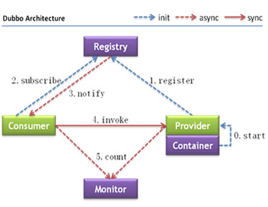

# Dubbo 入门

## Dubbo是什么?

* 一款分布式服务框架

* 高性能和透明化的RPC远程服务调用方案

* SOA服务治理方案

 
## Dubbo 基本架构

* Provider	暴露服务的服务提供方
* Consumer	调用远程服务的服务消费方
* Registry	服务注册与发现的注册中心
* Monitor	统计服务的调用次数和调用时间的监控中心
* Container	服务运行容器 

## Dubbo调用流程:  

1. 服务容器负责启动，加载，运行服务提供者。
2. 服务提供者在启动时，向注册中心注册自己提供的服务。
3. 服务消费者在启动时，向注册中心订阅自己所需的服务。
4. 注册中心返回服务提供者地址列表给消费者，如果有变更，注册中心将基于长连接推送变更数据给消费者。
5. 服务消费者，从提供者地址列表中，基于软负载均衡算法，选一台提供者进行调用，如果调用失败，再选另一台调用。
6. 服务消费者和提供者，在内存中累计调用次数和调用时间，定时每分钟发送一次统计数据到监控中心。

Dubbo提供的注册中心有如下几种类型可供选择：

* Multicast注册中心
* Zookeeper注册中心
* Redis注册中心
* Simple注册中心