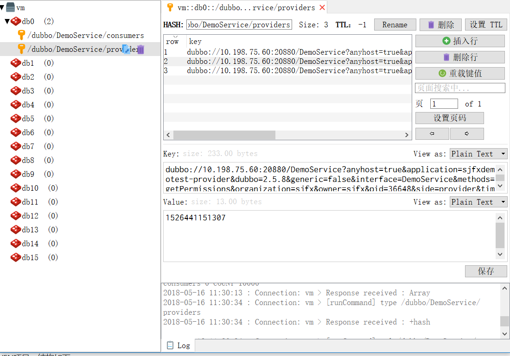

# 示例

本示例采用Dubbo与Zookeeper、Spring框架的整合。

## Zookeeper

Zookeeper是一个分布式的服务框架，是树型的目录服务的数据存储，能做到集群管理数据 ，这里能很好的作为Dubbo服务的注册中心。

安装请参考其他安装文档。

## 示例项目

创建MAVEN项目，结构如下：


主要分三大模块： 
* dubbo-api : 存放公共接口； 
* dubbo-consumer :　调用远程服务； 
* dubbo-provider : 提供远程服务。


### dubbo-api

在项目中定义服务接口：该接口需单独打包，在服务提供方(dubbo-provider)和消费方(dubbo-consumer)共享。

代码：

```java
public interface DemoService {
    List<String> getPermissions(Long id);
}
```


### dubbo-provider

用来打包供消费者使用, 实现公共接口，此实现对消费者隐藏。

`pom.xml`文件：

```xml
        <dependency>
            <groupId>cn.com.sjfx</groupId>
            <artifactId>dubbo-api</artifactId>
            <version>1.0-SNAPSHOT</version>
        </dependency>
```

代码：

```java
public class DemoServiceImpl implements DemoService {
    public List<String> getPermissions(Long id) {
        List<String> demo = new ArrayList<String>();
        demo.add(String.format("Permission_%d", id - 1));
        demo.add(String.format("Permission_%d", id));
        demo.add(String.format("Permission_%d", id + 1));
        return demo;
    }
}
```

用Spring配置声明暴露服务,`provider.xml`:

```xml
    <!--定义了提供方应用信息，用于计算依赖关系；在 dubbo-admin 或 dubbo-monitor 会显示这个名字，方便辨识-->
    <dubbo:application name="sjfxdemotest-provider" owner="sjfx" organization="sjfx"/>
    <!--使用 zookeeper 注册中心暴露服务，注意要先开启 zookeeper-->
    <dubbo:registry address="zookeeper://39.106.191.17:15181"/>
    <!-- 用dubbo协议在20880端口暴露服务 -->
    <dubbo:protocol name="dubbo" port="20880" />
    <!--使用 dubbo 协议实现定义好的 api.PermissionService 接口-->
    <dubbo:service interface="DemoService" ref="demoService" protocol="dubbo" />
    <!--具体实现该接口的 bean-->
    <bean id="demoService" class="DemoServiceImpl"/>
```

### dubbo-consumer

Consumer启动后调用远程服务：

```java
        ClassPathXmlApplicationContext context =
                new ClassPathXmlApplicationContext("consumer.xml");
        context.start();
        System.out.println("consumer start");
        DemoService demoService = context.getBean(DemoService.class);
        System.out.println("consumer");
        System.out.println(demoService.getPermissions(1L));
```

通过Spring配置引用远程服务：

```xml
    <dubbo:application name="sjfxdemotest-consumer" owner="sjfx" organization="sjfx"/>
    <!--向 zookeeper 订阅 provider 的地址，由 zookeeper 定时推送-->
    <dubbo:registry address="zookeeper://39.106.191.17:15181"/>
    <!--使用 dubbo 协议调用定义好的 api.PermissionService 接口-->
    <dubbo:reference id="permissionService" interface="DemoService"/>
```

这样一个简单的使用示例就完成了。

### 使用redis做注册中心

修改服务注册和引用配置（替换原来的zookeeper）

```xml
<!--向 redis 订阅 provider 的地址，由 redis 定时推送-->
    <dubbo:registry address="redis://192.168.181.180:6379"/>
```

添加依赖

```xml
        <dependency>
            <groupId>redis.clients</groupId>
            <artifactId>jedis</artifactId>
            <version>2.9.0</version>
        </dependency>
```

我们可以看看dubbo在redis中的注册和订阅信息：



