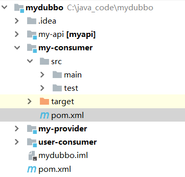
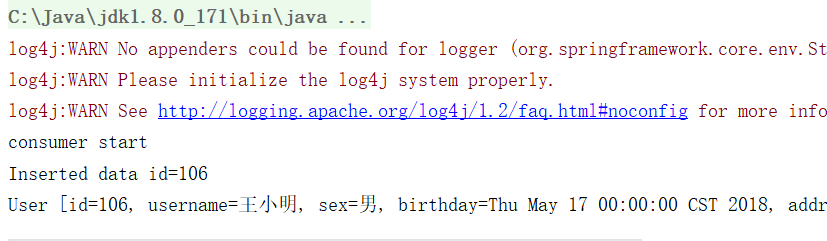
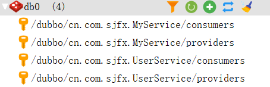
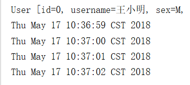
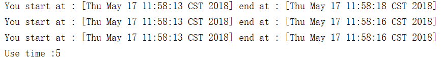
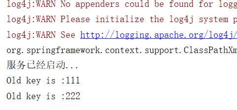
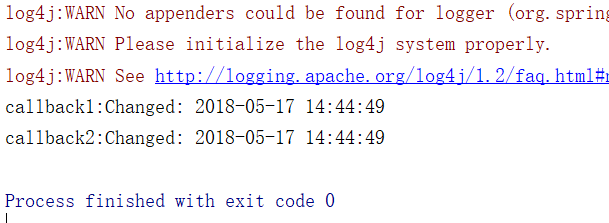

# 示例

此示例我们使用mybatis操作数据库，mybatis示例请参考我以前提供的示例源码。

## 数据库操作

新建maven项目`my-consumer`,现在整个项目目录结构如下：



请原谅我重新修改了模块名称和包结构，你需要用写轮眼忽略此章的项目和上一章不一致。

当然新增的项目不是重点，我们先修改主项目的`pom.xml`,添加mybatis依赖(当然你也可以增加到provider模块)

```xml
        <!-- 添加mybatis依赖 -->
        <dependency>
            <groupId>org.mybatis</groupId>
            <artifactId>mybatis</artifactId>
            <version>3.2.8</version>
        </dependency>
```

同样我们在api需要新增用户管理的代理接口`UserService`

```java
public interface UserService {
    int insertUser(User user);

    int updateUser(User user);

    int deleteUser(int id);

    User findByID(int id);

    List<User> findByName(String name);
}
```

此处应有数据实体`User`的引入

```java
public class User implements Serializable {
    private int id;
    private String username;// 用户姓名
    private String sex;// 性别
    private Date birthday;// 生日
    private String address;// 地址
……
```

特别注意`implements Serializable`,要不远程rpc访问不了。

同样如同示例一，我们在provider模块添加`interface UserService`的实现：

```java
public class UserServiceImpl implements UserService {
    // mybatis配置文件
    String resource = "SqlMapConfig.xml";
    public int insertUser(User user) {
        SqlSession sqlSession =  getSession();

        // 插入用户对象
        sqlSession.insert("test.insertUser", user);
        // 提交事务
        sqlSession.commit();

        // 获取用户信息主键
        int id = user.getId();
        // 关闭会话
        sqlSession.close();
        return id;
    }
……
```

同样如同示例一,我们在配置中声明服务:

```xml
    <!--使用 dubbo 协议实现定义好的 api.PermissionService 接口-->
    <dubbo:service interface="cn.com.sjfx.MyService" ref="myService" protocol="dubbo" />
    <dubbo:service interface="cn.com.sjfx.UserService" ref="userService" protocol="dubbo" />
    <!--具体实现该接口的 bean-->
    <bean id="myService" class="cn.com.sjfx.impl.MyServiceImpl"/>
    <bean id="userService" class="cn.com.sjfx.impl.UserServiceImpl"/>
```

当然不要忘记加入你mybatis的配置和映射。

最后，修改my-consumer的调用，

`consumer.xml`

```xml
    <!--向 redis 订阅 provider 的地址，由 redis 定时推送-->
    <dubbo:registry address="redis://192.168.181.180:6379"/>
    <!--使用 dubbo 协议调用定义好的 api.PermissionService 接口-->
    <dubbo:reference id="userService" interface="cn.com.sjfx.UserService"/>
```

`Consumer.java`

```java
public class Consumer {

    public static void main(String[] args) {
        //测试常规服务
        ClassPathXmlApplicationContext context =
                new ClassPathXmlApplicationContext("consumer.xml");
        context.start();
        System.out.println("consumer start");
        User user =new User();
        user.setUsername("王小明");
        user.setSex("男");
        user.setAddress("你说哪里就是哪里！");
        user.setBirthday(new Date());

        UserService userService = context.getBean(UserService.class);

        int insertID = userService.insertUser(user);

        System.out.println("Inserted data id="+insertID);

        System.out.println(userService.findByID(insertID).toString());
        context.close();
    }
}
```

不出意外你应该能够看到类似的输出结果：



我们再看看redis中的服务提供方和消费方的信息：



增加了UserService的信息

## 数据验证

dubbo的参数验证功能是基于 JSR303 实现的，用户只需标识 JSR303 标准的验证 annotation，并通过声明 filter 来实现验证。

JSR-303 是 JAVA EE 6 中的一项子规范，叫做 Bean Validation，官方参考实现是Hibernate Validator。
此实现与 Hibernate ORM 没有任何关系。 JSR 303 用于对 Java Bean 中的字段的值进行验证。 
Spring MVC 3.x 之中也大力支持 JSR-303，可以在控制器中对表单提交的数据方便地验证。 
注:可以使用注解的方式进行验证

添加依赖,修改主项目的`pom.xml`：

```xml
        <!-- 验证 -->
        <dependency>
            <groupId>javax.validation</groupId>
            <artifactId>validation-api</artifactId>
            <version>2.0.1.Final</version>
        </dependency>
        <dependency>
            <groupId>org.hibernate</groupId>
            <artifactId>hibernate-validator</artifactId>
            <version>4.2.0.Final</version>
        </dependency>
```

我们为`User.java`添加验证:

```java
    @NotNull(groups = UserService.UpdateUser.class)
    private int id;

    @Size(min = 8, max = 20)
    private String username;// 用户姓名

    @Pattern(regexp = "^[M|F]?$")
    private String sex;// 性别

    @Past
    private Date birthday;// 生日
```

我们还可以对方法参数进行验证，例如修改`UserService`的方法：

```java
    @interface UpdateUser{}
    int insertUser(@NotNull User user);

    int updateUser(@NotNull User user);

    int deleteUser(@Min(100)int id);

    User findByID(int id);

    List<User> findByName(@NotNull String name);
```

在客户端验证参数

```xml
    <!--使用 dubbo 协议调用定义好的 api.PermissionService 接口-->
    <dubbo:reference id="userService" interface="cn.com.sjfx.UserService" validation="true"/>
```

在服务器端验证参数

```xml
    <!--使用 dubbo 协议实现定义好的 api.PermissionService 接口-->
    <dubbo:service interface="cn.com.sjfx.MyService" ref="myService" protocol="dubbo" validation="true" />
    <dubbo:service interface="cn.com.sjfx.UserService" ref="userService" protocol="dubbo" validation="true" />
```


启动后客户端验证报错信息：
```
Caused by: javax.validation.ConstraintViolationException: Failed to validate service: 
cn.com.sjfx.MyService, method: saySomthings, cause: 
[ConstraintViolationImpl{interpolatedMessage='不能为null', propertyPath=saySomthingsArgument0, 
rootBeanClass=class cn.com.sjfx.MyService_SaySomthingsParameter_java.lang.String, 
messageTemplate='{javax.validation.constraints.NotNull.message}'}]
```

只要任意一端配置即可生效

## 数据缓存

Dubbo可对查询结果进行缓存，用于加速热门数据的访问速度，Dubbo 提供声明式缓存，以减少用户加缓存的工作量。

缓存类型有以下几种
* lru 基于最近最少使用原则删除多余缓存，保持最热的数据被缓存。
* threadlocal 当前线程缓存，比如一个页面渲染，用到很多 portal，每个 portal 都要去查用户信息，通过线程缓存，可以减少这种多余访问。
* jcache 与 JSR107(java缓存规范) 集成，可以桥接各种缓存实现。

 
在客户端简单配置即可使用
指定方法：

```xml
<dubbo:reference id="myService" interface="cn.com.sjfx.MyService" validation="true">
        <dubbo:method name="printDate" cache="lru" />
    </dubbo:reference>
```

指定类

```xml
<dubbo:reference id="myService" interface="cn.com.sjfx.MyService" validation="true" cache="lru" />
```

不启用缓存执行结果



启用缓存执行结果


后续：缓存过期更新等。

## 异步调用

接口和实现增加方法`asyncMethod`:

```java
    public String asyncMethod(int sleepTime) {
        Date start =new Date();
        try {
            Thread.sleep(sleepTime);
        } catch (InterruptedException e) {
            e.printStackTrace();
        }
        Date end =new Date();
        return "You start at : ["+start+"] end at : ["+end+"]";
    }
```

在 `consumer.xml` 中配置：

```xml
<dubbo:method name="asyncMethod" async="true" />
```

在服务端设置超时时间（延长）

```xml
<dubbo:service interface="cn.com.sjfx.MyService" ref="myService" protocol="dubbo" validation="true" timeout="12000" />
```

调用代码：

```java
        Instant start =Instant.now();
        // 此调用会立即返回null
        myService.asyncMethod(5000);
        // 拿到调用的Future引用，当结果返回后，会被通知和设置到此Future
        Future<String> future1 = RpcContext.getContext().getFuture();

        // 此调用会立即返回null
        myService.asyncMethod(3000);
        // 拿到调用的Future引用，当结果返回后，会被通知和设置到此Future
        Future<String> future2 = RpcContext.getContext().getFuture();

        // 此调用会立即返回null
        myService.asyncMethod(3000);
        // 拿到调用的Future引用，当结果返回后，会被通知和设置到此Future
        Future<String> future3 = RpcContext.getContext().getFuture();
        try {
            System.out.println(future1.get());
            System.out.println(future2.get());
            System.out.println(future3.get());
        } catch (InterruptedException e) {
            e.printStackTrace();
        } catch (ExecutionException e) {
            e.printStackTrace();
        }
        Instant end =Instant.now();

        System.out.println("Use time :" + Duration.between( start, end).getSeconds());
```

如果Future已返回，直接拿到返回值，否则线程wait住，等待Future返回后，线程会被notify唤醒输出结果：



这样我们原来顺序调用需要11秒的业务现在5秒就能完成了。和nodejs promise.all用法很类似。

## 回调

参数回调方式与调用本地 callback 或 listener 相同，只需要在 Spring 的配置文件中声明哪个参数是 callback 类型即可。Dubbo 将基于长连接生成反向代理，这样就可以从服务器端调用客户端逻辑。

api 创建服务接口

`CallbackService.java`

```java
public interface CallbackService {
    void addListener(String key, CallbackListener listener);
}
```

`CallbackListener.java`

```java
public interface CallbackListener {
    void changed(String msg);
}
```

在provider实现接口：

```java
public class CallbackServiceImpl implements CallbackService {

    public void addListener(String key, CallbackListener listener) {
        listener.changed(getChanged(key)); // 发送变更通知
    }

    private String getChanged(String key) {
        System.out.println("Old key is :" + key);
        return "Changed: " + new SimpleDateFormat("yyyy-MM-dd HH:mm:ss").format(new Date());
    }
}

```

修改客户端和服务端配置

`provider.xml`

```xml
    <dubbo:service interface="cn.com.sjfx.CallbackService" ref="callbackService" connections="1" callbacks="1000">
        <dubbo:method name="addListener">
            <!--通过指定类型的方式-->
            <dubbo:argument type="cn.com.sjfx.CallbackListener" callback="true" />
        </dubbo:method>
    </dubbo:service>
```

`consumer.xml`

```xml
    <dubbo:reference id="callbackService" interface="cn.com.sjfx.CallbackService" />
```

服务消费者调用：

```java
        ClassPathXmlApplicationContext context = new ClassPathXmlApplicationContext("classpath:consumer.xml");
        context.start();

        CallbackService callbackService = (CallbackService) context.getBean("callbackService");

        callbackService.addListener("111", new CallbackListener(){
            public void changed(String msg) {
                System.out.println("callback1:" + msg);
            }
        });

        callbackService.addListener("222", new CallbackListener(){
            public void changed(String msg) {
                System.out.println("callback2:" + msg);
            }
        });
        context.close();
```

执行结果：

服务提供端



服务消费端



这里有一个坑，需要把controller的位置放到dubbo.Service下一级，这里就算你在引入的地方加上@Lazy 延迟加载注解也调用不到，我反正都是调整包结构解决的空指针异常。