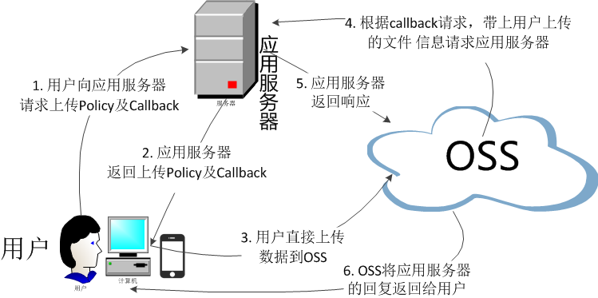

# OSS需求解决方案

## OSS整体结构图

## 需求决策方案
<table>
    <tr>
        <td>项目</td>
        <td>说明</td>
        <td>描述</td>
        <td>备注</td>
    </tr>
    <tr>
        <td rowspan="2">访问方式</td>
        <td>内网访问</td>
        <td>即ecs、cdn与oss之间请求</td>
        <td rowspan="2">OSS是单向收费。即输出流量收费</td>
    </tr>
    <tr>
        <td>外网访问</td>
        <td>Internet直接cname挂载配置映射地址</td>
    </tr>
    <tr>
        <td rowspan="3">鉴权方式ACL</td>
        <td>AK</td>
        <td>阿里云账号AK特指Bucket拥有者的AK，每个阿里云账号提供的AccessKey对拥有的资源有完全的权限。每个阿里云账号能够同时拥有不超过5个active或者inactive的AK对（AccessKeyId和AccessKeySecret）。用户可以登录AccessKey管理控制台，申请新增或删除AK对。每个AK对都有active/inactive两种状态。</td>
        <td rowspan="3">考虑安全可以先尝试使用STS。前端通过SjfxOSS服务获取Token让后再提交或获取图片信息</td>
    </tr>
    <tr>
        <td>RAM</td>
        <td>RAM (Resource Access Management) 是阿里云提供的资源访问控制服务。RAM账号AK指的是通过RAM被授权的AK。这组AK只能按照RAM定义的规则去访问Bucket里的资源。通过RAM，您可以集中管理您的用户（比如员工、系统或应用程序），以及控制用户可以访问您名下哪些资源的权限。比如能够限制您的用户只拥有对某一个Bucket的读权限。子账号是从属于主账号的，并且这些账号下不能拥有实际的任何资源，所有资源都属于主账号。</td>
    </tr>
     <tr>
        <td>STS</td>
        <td>STS（Security Token Service）是阿里云提供的临时访问凭证服务。STS账号AK指的是通过STS颁发的AK。这组AK只能按照STS定义的规则去访问Bucket里的资源。</td>
    </tr>
    <tr>
        <td rowspan="3">开发SDK</td>
        <td>.Net SDK</td>
        <td>官方提供的只是2.0的包，是否能和Asp.Net Core 2.0直接调用</td>
        <td>因为网上公布了Asp.Net Core 2.0 已经不支持.Net 2.0了。</td>
    </tr>
    <tr>
        <td>PHP SDK、PYTHON SDK</td>
        <td>继承全栈式框架，对于接口编写，扩展都有现成的框架可用</td>
        <td></td>
    </tr>
    <tr>
        <td>Node SDK</td>
        <td>NIO，在并发下请求资源NodeJS有先天优势</td>
        <td></td>
    </tr>
    <tr>
        <td>JAVA SDK</td>
        <td>整体性配合Springboot+cloud 微服</td>
        <td></td>
    </tr>
</table>

## 协调事项
为方便开发测试相关接口申请项如下：
1.	AK权限：属于aliyun 子账户，正式测试上线优先使用STS，令牌鉴权形式。
2.	Bucket：测试使用的临时存储，调试阶段与生产环境区分开来。
3.	CNAME：因为OSS支持域名映射，考虑到上网络图结构，采用官方推荐方案。即，直接CNAME域名映射OSS。
4.	测试应用服务器：搭建服务环境。
