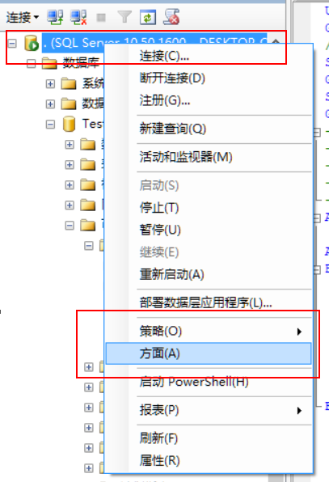
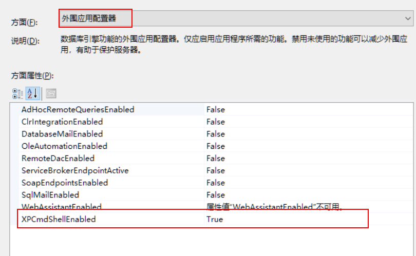

# 存储过程执行程序

1.  设置数据库方面信息
    
2.  设置外围应用程序，XPCmdShellEnabled 设置为 true
    
3. 或者在数据库执行以下代码

```sql
    EXEC sp_configure 'show advanced options', 1; 
    go;
    RECONFIGURE;  
    go;
    EXEC sp_configure 'xp_cmdshell', 1; 
    go;
    RECONFIGURE;
``` 

4. 调用请参考以下存储过程

    ```sql
    ALTER PROCEDURE [dbo].[P_RunCommand]
        @Memo NVARCHAR(4000)
    AS
    BEGIN
        DECLARE @CommandForCore NVARCHAR(255);
        DECLARE @CommandForCmd NVARCHAR(255);
        DECLARE @IsSuccess bit;
        -- 调用普通程序
        set @CommandForCmd = 'C:\Code\SJFX.Cap\TestProcedureCmd\bin\Debug\TestProcedureCmd ' + @Memo
        -- 调用core程序
        set @CommandForCore = 'dotnet C:\Code\SJFX.Cap\TestProcedure\bin\Debug\netcoreapp2.0\TestProcedure.dll ' + @Memo
        exec @IsSuccess = xp_cmdshell @CommandForCmd
        exec @IsSuccess = xp_cmdshell @CommandForCore
        if @IsSuccess <> 0 then
            --进行必要容错处理。
        end
    END
    ```

4.  Cap 调用参考

    ```c#
    class Program
    {
        // 数据库连接字符串
        private static readonly string _connectionString = @"Data Source=localhost;Initial Catalog=Test;Persist Security Info=True;User ID=sa;Password=123456";
        // kafka连接字符串
        private static string _serverList = "jwt.sjfx.com.cn:9092";

        static void Main(string[] args)
        {
            //定义发布程序
            ICapPublisher publisher;
            //注入服务
            IServiceCollection services = new ServiceCollection();
            services.AddLogging();
            services.AddCap(x =>
            {
                // 如果你使用的Dapper，你需要添加如下配置：
                x.UseSqlServer(_connectionString);

                //如果你使用的 Kafka 作为MQ，你需要添加如下配置：
                x.UseKafka(_serverList);
            });
            publisher = services.BuildServiceProvider().GetService<ICapPublisher>();

            // 验证是否有数据传入，这里演示的是一个属性，可以改为一个json对象，注意数据库长度不能大于4000，
            if (args?.Length <= 0)
            {
                Console.WriteLine(-1);
                return;
            }

            using (var connection = new SqlConnection(_connectionString))
            {
                connection.Open();
                Person person = new Person { Id = 3, Person_Name = args[0], Age = 5, };
                using (var trans = connection.BeginTransaction())
                {
                    //发布数据修改
                    publisher.Publish("test001", person, trans);

                    //执行业务操作，这个过程可以不需要
                    connection.Execute("INSERT INTO people VALUES (@id,@person_name,@age,@created)", param: person, transaction: trans);
                    trans.Commit();
                }
            }

            using (var connection = new SqlConnection(_connectionString))
            {
                //connection.Execute("Create table people (Id INT PRIMARY KEY ,Person_Name VARCHAR(128),Age INT,created DATETIME);");
                var people = connection.Query("select * from people");
                var published = connection.Query("select * from Cap.Published");
            }

            Console.WriteLine(0);
        }
    ```
