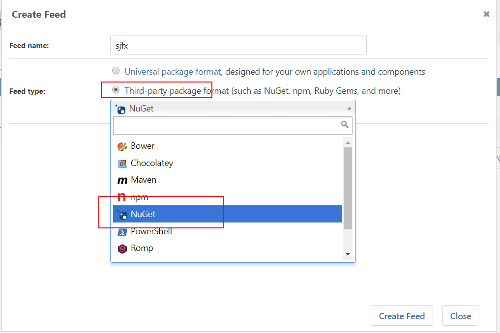
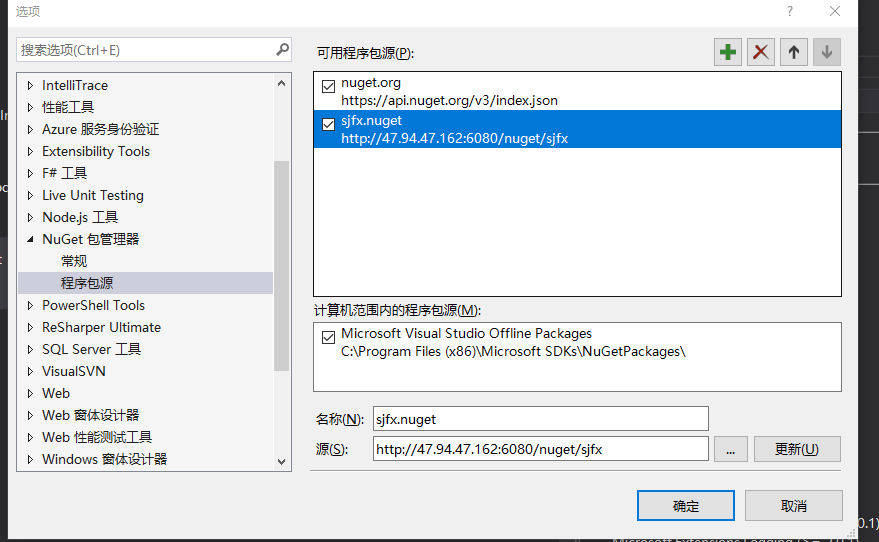

# Nuget ProGet

* 服务器安装

  1.  初始化目录

```sh
mkdir -p /mnt/proget/packages
mkdir -p /mnt/proget/extensions
mkdir -p /mnt/progetpostgres/db
chmod 777 /mnt/proget/packages
chmod 777 /mnt/proget/extensions
chmod 777 /mnt/progetpostgres/db
```

1.  创建容器 注意：要创建网络且/etc/localtime 要一致

```sh
docker network create proget

docker run -d -v /etc/localtime:/etc/localtime:ro -v /mnt/progetpostgres/db:/var/lib/postgresql/data --net=proget --name=proget-postgres --restart=unless-stopped postgres:9.5

docker run -d -v /etc/localtime:/etc/localtime:ro -v /mnt/proget/packages:/var/proget/packages -v /mnt/proget/extensions:/var/proget/extensions -p 6080:80 --net=proget --name=proget --restart=unless-stopped inedo/proget:latest
```
docker run -d -v /etc/localtime:/etc/localtime:ro -v /mnt/proget/packages:/var/proget/packages -v /mnt/proget/extensions:/var/proget/extensions -p 6080:80 --net=proget --name=proget --restart=unless-stopped inedo/proget:5.0.11

1.  防火墙开启端口

```sh
firewall-cmd --zone=public --add-port=6080/tcp
firewall-cmd --zone=public --add-port=6080/tcp --permanent
```

* 服务器配置

  1.  访问站点 ip:6080,使用 Admin:Admin 登陆，并记得修改密码。

  1.  去官网申请一个免费 Licens 并激活

  1.  创建 Feeds，记得选第三方包格式的 Nuget

  

  1.  发布的时候记得选择 feeds 就好

  1.  注意：在更换用户 nuget 源以后，发布服务器的 nuget 配置需要修改，windows 系统在用户->AppData\Roaming\NuGet\NuGet.Config;Linux 在用户/.nuget/NuGet/NuGet.Config，jenkins 在/var/lib/jenkins/.nuget/NuGet/NuGet.Config，添加用户 nuget 源就好

  注意：在更换用户 nuget 源以后，发布服务器的 nuget 配置需要修改，windows 系统在用户->AppData\Roaming\NuGet\NuGet.Config;Linux 在用户/.nuget/NuGet/NuGet.Config，jenkins 在/var/lib/jenkins/.nuget/NuGet/NuGet.Config，添加用户 nuget 源就好

  注意：在更换用户 nuget 源以后，发布服务器的 nuget 配置需要修改，windows 系统在用户->AppData\Roaming\NuGet\NuGet.Config;Linux 在用户/.nuget/NuGet/NuGet.Config，jenkins 在/var/lib/jenkins/.nuget/NuGet/NuGet.Config，添加用户 nuget 源就好

* 使用，新建一个 Nuget 数据源

  


firewall-cmd --zone=public --add-port=80/tcp
firewall-cmd --zone=public --add-port=80/tcp --permanent

docker run --rm -it -v /mnt/Sjfxsoft.AuthCenter:/app --workdir /app microsoft/aspnetcore-build:2.0.6-2.1.101-stretch bash -c "dotnet publish -c Release -o ./PublishOutput"

docker run --rm -it -v $(PWD):/app --workdir /app microsoft/aspnetcore-build bash -c "dotnet publish -c Release -o ./bin/Release/PublishOutput"

docker build -t sjfx/corebuild:2.0.6 .

docker run -rm -it  sjfx/corebuild:2.0.6 cat /root/.nuget/NuGet/NuGet.Config

docker run --rm -it -v /mnt/Sjfxsoft.AuthCenter:/app --workdir /app sjfx/corebuild:2.0.6 bash -c "dotnet publish -c Release -o ./PublishOutput"

docker rm -f proget
docker run -d -v /etc/localtime:/etc/localtime:ro -v /mnt/proget/packages:/var/proget/packages -v /mnt/proget/extensions:/var/proget/extensions -p 6080:80 --net=proget --name=proget --restart=unless-stopped inedo/proget:5.0.12